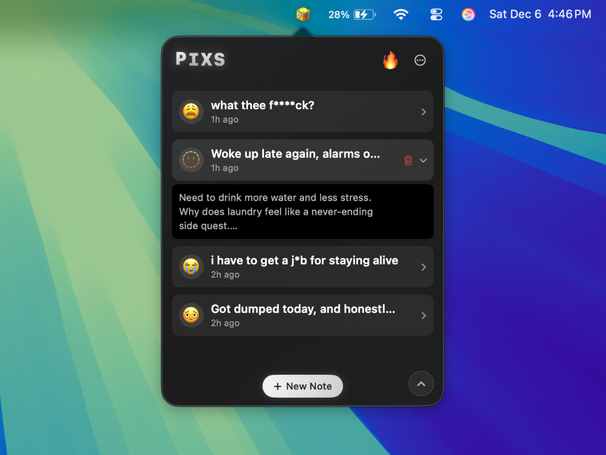
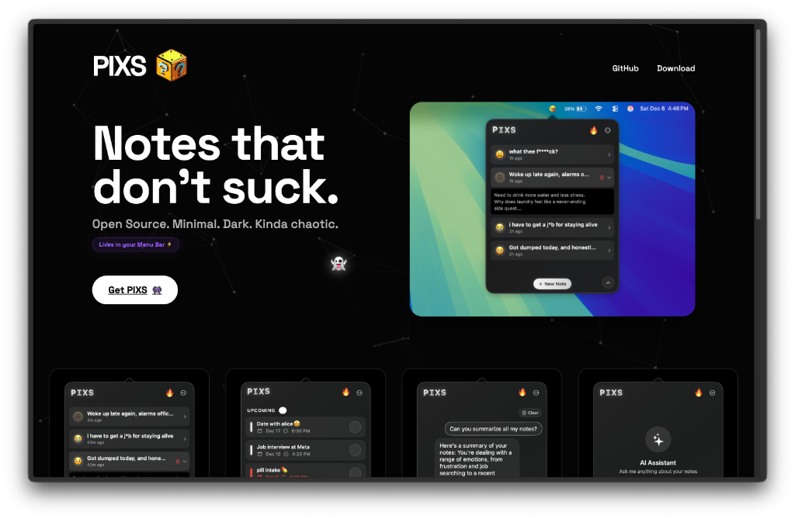

# PIXS 👾

> Notes that don't suck.

 

🌐 **[Visit the Website](https://pixs-xi.vercel.app/)**





**PIXS** is a minimal, dark-mode-first note-taking and reminders app for macOS. It's built for people who like pixels, ghosts, and getting things done without the bloat.

## 🌟 Features

- **Notes**: Clean, Apple Notes-style editor with markdown support.
- **Reminders**: Integrated tasks with direct calendar access.
- **AI Companion**: Optional Gemini integration to chat with your notes.
- **Vibe**: Animated header, smooth hover effects, and a "Glass Liquid" aesthetic.
- **Privacy**: Your data stays local (unless you send it to Gemini).

## 🛠️ Tech Stack

- **SwiftUI**: 100% native macOS declarative UI.
- **AppKit**: For that sweet menu bar integration.
- **UserNotifications**: For local reminders and alerts.
- **Gemini 2.0 Flash**: For the brain.

## 🚀 Getting Started

1. Clone this repo.
   ```bash
   git clone https://github.com/yourusername/PIXS.git
   ```
2. Open `PIXS.xcodeproj` in Xcode.
3. Build & Run (Cmd+R).
4. Enjoy the pixels.

## 📄 License

MIT License © 2025 [Rahul](https://github.com/therahul-yo)

See [LICENSE](LICENSE) for details.

---
*Made with 💀 and ☕️ by Rahul.*
